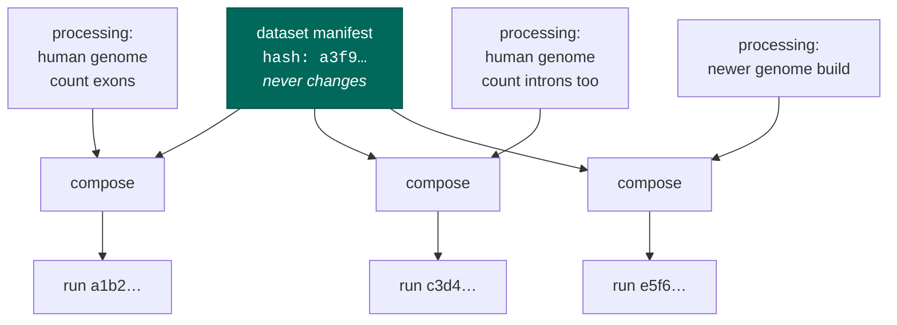

# The two artifacts

seqforge produces two files, and almost every design argument in the project reduces to *why they are
two files and not one*.

## A fact and a choice are different things

Consider what you know about a finished sequencing run:

- Those molecules went through that flowcell and produced those bytes. That is **a fact**. It
  happened in the past. It is not going to happen differently later.
- You are going to align it to a particular genome and count particular things. That is **a choice**.
  It is defensible, someone else's is also defensible, and next year you will want to redo it with a
  better aligner.

Facts and choices have different lifetimes, so they get different files:

| | **dataset manifest** | **processing manifest** |
|---|---|---|
| answers | what the data **is** | what to **do** with it |
| authority | the bytes, and the people who ran the experiment | you |
| how many | exactly one per dataset | as many as you like |
| can it change? | **no** — it is content-addressed and written once | yes, freely |

## Why not one file?

Because the moment they share a file, re-processing edits the truth.

Suppose you keep everything in one manifest and you decide to re-run a dataset with a different
genome build. You edit the file. Now the record of *what the data is* has changed — but nothing about
the data changed. You did.

Worse: the file's identity changed too. If you were using its hash to say "this is that dataset",
you have now silently claimed it is a different dataset. Do that across ten thousand datasets over
three years and the corpus's provenance is fiction.

So the rule is absolute: **changing your mind about processing must never perturb the dataset's
hash.** There is a test whose only job is to compile one dataset three different ways and assert the
dataset hash never moves.

## Same source, different flags

The compiler analogy is doing real work here, not decorating:

Three runs, three distinct identities, one unchanged fact at the top. Each run's identity is computed
from everything that went into it — the dataset, the choices, the knowledge base version, and the
pipeline module version — so two runs can never collide, and a run can always be traced back to
exactly what produced it.

`-O2` does not get to edit your source code. A processing manifest does not get to edit the dataset
manifest.

## The line: parsing versus counting

There is one more consequence, and it is the reason the system can safely accept instructions from a
human at all.

**How to parse the reads** — where the barcode starts, how long the unique molecular identifier is,
which strand was read — is decided by the bytes. You cannot instruct it, and neither can a paper.
Those settings live in the knowledge base.

**What to count** — genes, or genes-plus-introns, against which genome — is a choice. That lives in
the processing manifest, and you can instruct it.

The two sets of settings **do not overlap**. Not "the user's instruction is deprioritized if it
conflicts with the bytes" — there is simply no way to write the conflicting instruction down. You
have no vocabulary in which to say "the barcode is 10 bases long", because that word does not exist
in the file where you are allowed to write.

That is why seqforge can read your instructions without ever trusting them: it lets you talk only
about things you are entitled to decide.
