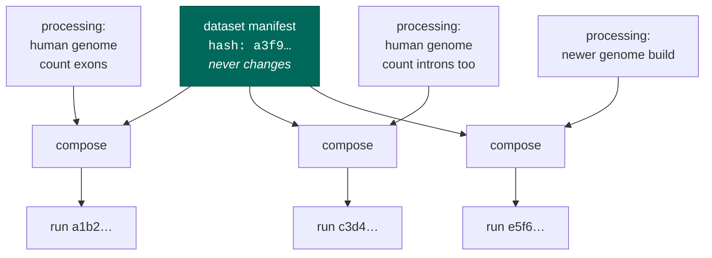

# The two artifacts

seqforge produces two files, and almost every design argument reduces to *why they are two files and
not one*.

## A fact and a choice are different things

Those molecules went through that flowcell and produced those bytes: **a fact**, already in the past.
You are going to align it to a particular genome and count particular things: **a choice**, which
someone else could defensibly make differently, and which you will redo next year with a better
aligner.

Facts and choices have different lifetimes, so they get different files:

| | **dataset manifest** | **processing manifest** |
| --- | --- | --- |
| answers | what the data **is** | what to **do** with it |
| authority | the bytes, and the people who ran the experiment | you |
| how many | exactly one per dataset | as many as you like |
| can it change? | **no** — content-addressed, written once | yes, freely |

## Why not one file?

Because the moment they share a file, re-processing edits the truth. Re-run with a different genome
build and you edit the file — but nothing about the data changed. You did. And the file's identity
changed with it: if you were using its hash to say "this is that dataset", you have silently claimed
it is a different one. Do that across ten thousand datasets and the corpus's provenance is fiction.

So the rule is absolute: **changing your mind about processing must never perturb the dataset's
hash.** A test compiles one dataset three ways and asserts the hash never moves.

## Same source, different flags

Three runs, three identities, one unchanged fact at the top. Each run's identity is computed from
everything that went into it — dataset, choices, knowledge base version, pipeline module version — so
runs cannot collide, and any run traces back to exactly what produced it.

`-O2` does not get to edit your source code. A processing manifest does not get to edit the dataset
manifest.

## The line: parsing versus counting

**How to parse the reads** — where the barcode starts, how long the UMI is, which strand — is decided
by the bytes. You cannot instruct it, and neither can a paper. It lives in the knowledge base.

**What to count** — genes, or genes-plus-introns, against which genome — is a choice. It lives in the
processing manifest, and you can instruct it.

The two sets **do not overlap**. Not "your instruction is deprioritized if it conflicts with the
bytes" — there is no way to write the conflicting instruction down. You have no vocabulary in which
to say "the barcode is 10 bases long".

That is why seqforge can read your instructions without ever trusting them: it lets you talk only
about things you are entitled to decide.

## One project, one or more datasets

The table above says "exactly one dataset manifest per dataset", and a dataset is **one chemistry**. A
real study is often not that: a single archive series can mix 10x v2 and v3 libraries, and a manifest
that averaged the two would describe neither.

So a heterogeneous project **splits into assays** — one per chemistry, decided from the bytes, never
by you. Each assay is an ordinary dataset: its own immutable `manifest.yaml`, its own hash, its own
Snakefile, under its own `seqforge/<assay>/` directory. Nothing about the single-dataset story
changes; there are simply several of them.

Two files tie the project back together at the top level:

- **`sample_metadata.tsv`** — one row per sample across every assay, one column per field (strain,
  age, tissue, diet, chemistry, files…): the flat "one study" view.
- **`project.yaml`** — the index of which assays exist, their chemistry and sample counts, and where
  each one's manifest and pipeline live.

A uniform project — most of them — is the degenerate case: one assay, the flat layout of the rest of
this guide, plus that top-level `sample_metadata.tsv`.
