```mermaid
flowchart TD
    R0["<b>0 · the prose</b><br/>'10x 3′ v3.1', from a paper or database<br/><i>a hypothesis — never a conclusion</i>"]
    R1["<b>1 · the filenames</b><br/><i>a weak hint, never decisive</i>"]
    R2["<span style='color:#fff'><b>2 · the shape of the reads</b><br/>read lengths, which stretches are random,<br/>which are fixed, which barcodes repeat<br/><i>free — we are reading the bytes anyway</i></span>"]
    R3["<span style='color:#fff'><b>3 · check one barcode list</b><br/>do these barcodes appear in 10x's<br/>published list of real barcodes?<br/><i>~100 milliseconds</i></span>"]
    R7["<b>7 · ask a human</b><br/><i>expensive — and that is the point</i>"]

    R0 --> R1 --> R2 --> R3
    R3 -->|"a genuine tie that<br/>would change the output"| R7
    R3 -->|"decided"| DONE["<span style='color:#fff'>dataset manifest</span>"]

    %% The inline white <span> is required on dark fills — see the comment in docs/index.md.
    classDef artifact fill:#00695c,stroke:#004d40
    classDef output fill:#37474f,stroke:#263238
    class R2,R3 artifact
    class DONE output
```

# How a dataset is identified

Given a folder of FASTQ files and maybe a sentence of prose, seqforge has to work out what the data
actually is. This page explains how, and why it is done in that order.

## Filenames are not evidence

The single most important thing to understand: **`_1` and `_2` mean nothing.**

When public data is downloaded from an archive, the tool that unpacks it numbers the files in the
order it happens to find them. A file called `SRR123_1.fastq.gz` is not "read 1" in any biological
sense. It might hold the cell barcodes. It might hold the actual RNA sequence. It might be missing
entirely.

So seqforge never trusts the name. It opens the files and looks.

## Cheap things first

Answers are ranked by what they cost. seqforge starts at the bottom and only climbs when it has to:

Rungs 0 to 3 cost well under a second, and they settle almost everything. The numbering leaves room
between the barcode check and asking a human for intermediate rungs — a broader barcode search, a
genome sketch, a trial alignment — so an ambiguity that survives rung 3 goes straight to a human.

## The prose proposes; the bytes decide

Notice where the prose sits: at the **bottom**, as rung 0.

That is not disrespect. Metadata is genuinely useful — it turns an open-ended search ("what could
this be?") into a cheap yes/no check ("the page says 10x v3; do these barcodes match 10x v3's
list?"). One targeted check instead of trying everything.

But it is only ever a *hypothesis*. Trust it enough to skip the search; never enough to skip the
check. If the page says one thing and the bytes say another, that disagreement is **surfaced as a
conflict**, and the bytes win on the factual question. Nobody is asked to take the page's word.

## What the bytes give away for free

While streaming a bounded sample of reads, some things fall out at no cost:

- **Which stretches are fixed and which are random.** If almost every read has the same base at
  position 30, that position is a fixed piece of adapter, not data. Long runs of `T` are a poly-T
  tail. Uniform random stretches are where the real information is.
- **Which stretches repeat.** Cell barcodes recur, because you sequence the same cell many times. So
  if a stretch has few distinct values across many reads, it is a barcode. Unique molecular
  identifiers and actual RNA are nearly all distinct. This tells barcodes from identifiers **with no
  barcode list at all**.
- **Whether someone already trimmed the file.** A sequencer produces reads of exactly one length. If
  a technical read has several lengths, someone ran a trimming tool before uploading — and trimming
  tools do not know a barcode from an adapter. Offsets may have shifted. That is a refusal, not a
  warning.

## Roles are solved, not guessed

Once seqforge knows what a technology *expects* — say, "one 28-base read holding a barcode, and one
variable-length read holding RNA" — it tries every way of matching the files to those slots and keeps
the arrangement best supported by the evidence.

The technology's score **is** the score of its best arrangement. So a swapped `_1`/`_2` produces an
identical answer, because the filenames were never consulted.

## Reading a whole file is a bug

Every look at a FASTQ is bounded: at most 200,000 reads and at most 256 MB of decompressed data,
whichever comes first.

This is a hard rule, not a performance tip. A code path that *can* stream a whole multi-gigabyte file
is considered a defect even if today's file happens to be small — because eventually it won't be, and
by then the code path is load-bearing. There is a test that hands the probe a file which is 128 MB
when decompressed and asserts it reads about a tenth of it and stops.

Note what the budget is measured in: **reads and bytes, never seconds.** Wall-clock time depends on
the disk, the compression level, and whether the machine is busy. It is a consequence, not a
constraint.
