# How a dataset is identified

## Filenames are not evidence

**`_1` and `_2` mean nothing.** Those numbers come from whatever wrote the files — an archive's
unpacking tool numbering them in the order it found them, a sequencer's demultiplexer, a script
someone wrote once and forgot. `SRR123_1.fastq.gz` is not "read 1" in any biological sense. It might
hold the barcodes, it might hold the RNA, it might be missing.

So seqforge never trusts the name. It opens the files and looks.

## Cheap things first

Answers are ranked by cost. seqforge starts at the bottom and climbs only when it has to:

```mermaid
flowchart TD
    R0["<b>0 · the prose</b><br/>'10x 3′ v3.1', from a paper or database<br/><i>a hypothesis — never a conclusion</i>"]
    R1["<b>1 · the filenames</b><br/><i>a weak hint, never decisive</i>"]
    R2["<span style='color:#fff'><b>2 · the shape of the reads</b><br/>read lengths, which stretches are random,<br/>which are fixed, which barcodes repeat<br/><i>free — we are reading the bytes anyway</i></span>"]
    R3["<span style='color:#fff'><b>3 · check one barcode list</b><br/>do these barcodes appear in 10x's<br/>published list of real barcodes?<br/><i>~100 milliseconds</i></span>"]
    R7["<b>7 · ask a human</b><br/><i>expensive — and that is the point</i>"]

    R0 --> R1 --> R2 --> R3
    R3 -->|"a genuine tie that<br/>would change the output"| R7
    R3 -->|"decided"| DONE["<span style='color:#fff'>dataset manifest</span>"]

    %% The inline white <span> is required on dark fills — see the comment in docs/index.md.
    classDef artifact fill:#00695c,stroke:#004d40
    classDef output fill:#37474f,stroke:#263238
    class R2,R3 artifact
    class DONE output
```

Rungs 0 to 3 cost well under a second and settle almost everything. The numbering leaves room for
intermediate rungs — a broader barcode search, a genome sketch, a trial alignment — so an ambiguity
surviving rung 3 goes straight to a human.

## The prose proposes; the bytes decide

Notice where the prose sits: at the **bottom**, as rung 0.

That is not disrespect. Metadata turns an open-ended search ("what could this be?") into a cheap
yes/no check ("the page says 10x v3; do these barcodes match v3's list?"). Trust it enough to skip
the search, never enough to skip the check.

If the page and the bytes disagree, that is **surfaced as a conflict**, and the bytes win on the
factual question.

## What the bytes give away for free

While streaming a bounded sample:

- **Which stretches are fixed and which are random.** The same base at position 30 in almost every
  read is adapter, not data. Long runs of `T` are a poly-T tail.
- **Which stretches repeat.** Barcodes recur, because you sequence the same cell many times; UMIs and
  RNA are nearly all distinct. This tells barcodes from UMIs **with no barcode list at all**.
- **Whether someone already trimmed the file.** A sequencer produces reads of exactly one length. If
  a technical read has several, a trimming tool ran before upload — and trimming tools do not know a
  barcode from an adapter. Offsets may have shifted. That is a refusal, not a warning.

## Roles are solved, not guessed

Once seqforge knows what a technology *expects* — "one 28-base read holding a barcode, one
variable-length read holding RNA" — it tries every way of matching files to slots and keeps the
arrangement best supported by the evidence. The technology's score **is** its best arrangement's
score, so a swapped `_1`/`_2` gives an identical answer.

## Reading a whole file is a bug

Every look at a FASTQ is bounded: at most 200,000 reads and 256 MB decompressed, whichever comes
first. A code path that *can* stream a whole multi-gigabyte file is a defect even if today's file is
small — because eventually it won't be, and by then the path is load-bearing. A test hands the probe
a 128 MB file and asserts it reads about a tenth and stops.

Note the units: **reads and bytes, never seconds.** Wall-clock depends on the disk, the compression
level, and whether the machine is busy. It is a consequence, not a constraint.
