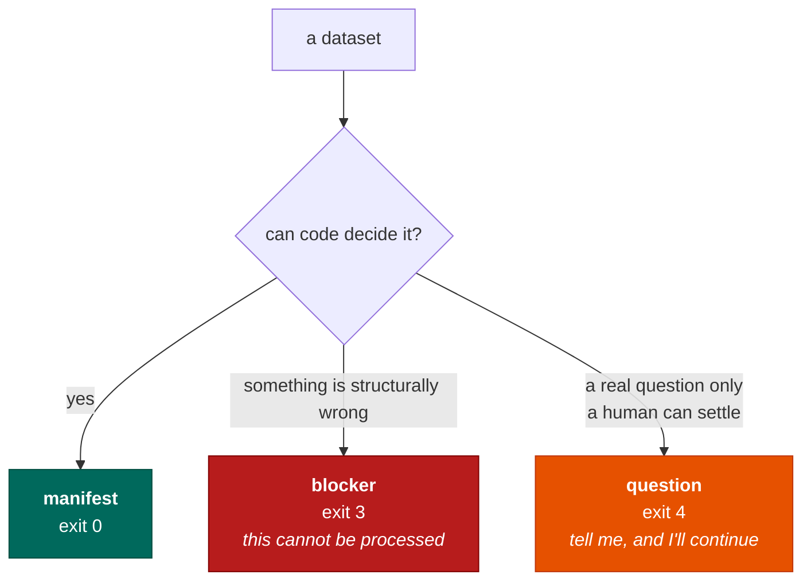
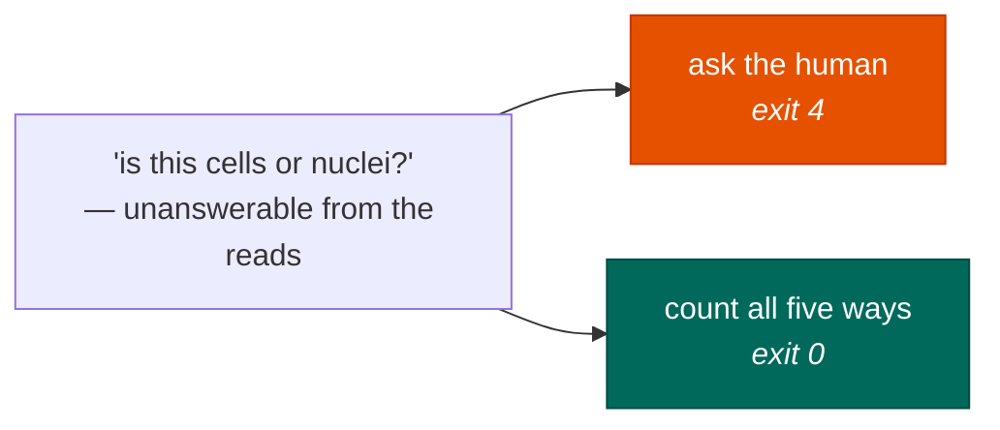

# When it refuses

The most useful thing seqforge does is stop.

A tool that always produces an answer is only trustworthy if you can check the answer. At ten
thousand datasets, nobody checks. So seqforge is built to fail loudly in the cases where a normal
pipeline would fail silently.

## Three ways it can end

A refusal is an **exit code**, not a warning in a log. Code decides whether processing may proceed.
The language model never gets a vote; at most it helps phrase the question.

Every blocker carries a specific reason and an actionable remedy. "Could not process" is not a
remedy. "The barcode read is missing — re-fetch including technical reads, or pull the submitter's
original files" is.

## The failures worth catching are the quiet ones

Loud failures take care of themselves. If a file is corrupt, everything downstream explodes and you
notice. These are the ones seqforge is really built for:

**The wrong strand.** The RNA was read in one direction; the config says the other. About half the
reads land unassigned. The aligner exits successfully and gives you a matrix that just looks like a
thin dataset. Public metadata essentially never states the strand.

**A trimmed barcode file.** Someone ran a trimming tool before uploading. Most reads are still the
right length, so the geometry checks all pass. But some reads shifted, so the barcode is read from
the wrong position — an arbitrary sequence matching no real barcode. Those cells are dropped. The
matrix is thin. Exit code 0.

**The wrong genome.** Everyone's default is human. Point a worm dataset at the human genome and
almost nothing maps — which is loud, and therefore fine. The same mistake between two *similar*
genomes is silent, and it produces a plausible matrix in the wrong coordinate space that nothing
downstream would ever question.

**Counting only exons on a nuclear sample.** Nuclei are full of unspliced RNA sitting in introns.
Count only exons and you throw it away. We measured this: **40.7%** of a nuclear library, gone, with
no error. The chemistry is byte-identical to the whole-cell version, so no amount of looking at the
reads can tell you which one you have.

Notice the pattern. Every one of them exits 0.

## Never ask a question you don't need answered

Refusing is expensive too — a system that interrogates you constantly is one you route around, and
then it protects nobody. So there are two rules about when *not* to ask.

**Don't ask if the answer can't change anything.** Two versions of the 10x chemistry may be
impossible to tell apart from the reads. If they produce *identical* settings, the distinction is
irrelevant: record both names and move on. This is computed, not assumed — there is a check over
every pair of technologies asserting that "these are indistinguishable" and "these produce identical
settings" agree with each other.

**Don't ask if you can afford every answer.** The nuclear-versus-whole-cell question above is
unanswerable from the reads. But we don't have to answer it — we can count **all five ways at once**.
One alignment, five counting rules, one pass. Download and alignment dominate the cost so completely
that the extra counting is close to free.

So we don't ask. We produce every answer and let you pick.

Save the interruptions for things that are genuinely exclusive — a genome, an aligner — where you
really do have to choose one.
