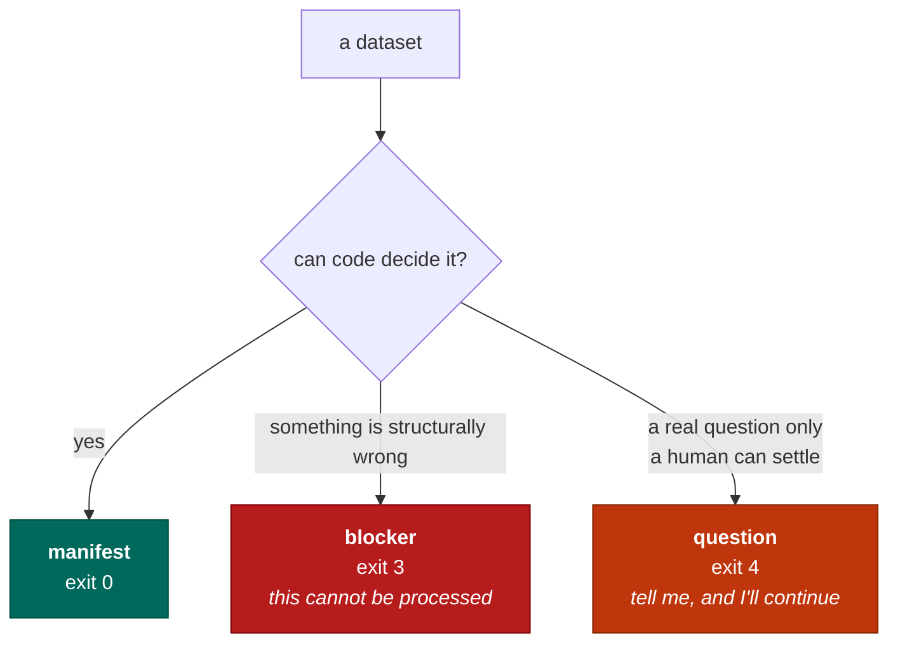
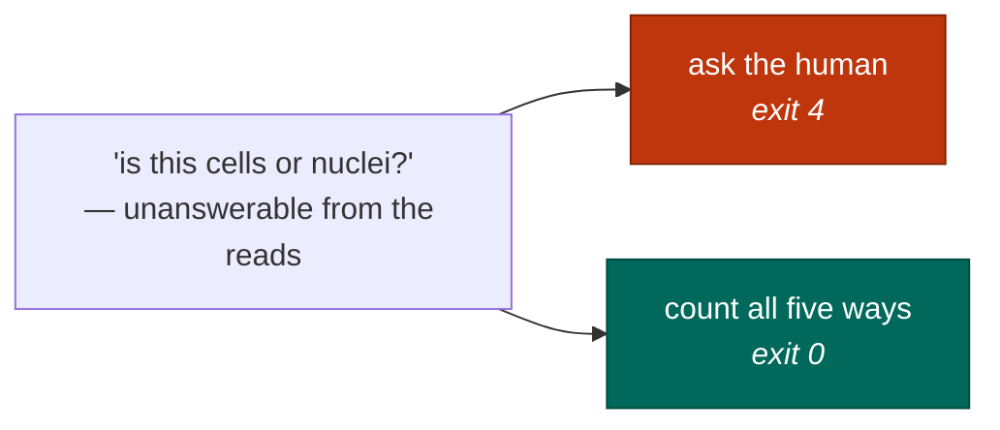

# When it refuses

The most useful thing seqforge does is stop. A tool that always produces an answer is only
trustworthy if you check the answer, and at ten thousand datasets nobody checks. So it is built to
fail loudly where a normal pipeline fails silently.

## Three ways it can end

A refusal is an **exit code**, not a warning in a log. Code decides whether processing may proceed;
the language model never gets a vote, and at most helps phrase the question.

Every blocker carries a reason and an actionable remedy. "Could not process" is not a remedy. "The
barcode read is missing — re-fetch including technical reads, or pull the submitter's original files"
is.

## The failures worth catching are the quiet ones

Loud failures take care of themselves: a corrupt file explodes and you notice. These do not.

**The wrong strand.** About half the reads land unassigned, and the matrix just looks like a thin
dataset. Public metadata essentially never states the strand.

**A trimmed barcode file.** A trimming tool ran before upload. Most reads are still the right length,
so the geometry checks pass — but some shifted, so the barcode is read from the wrong position and
those cells are dropped.

**The wrong genome.** A worm dataset against the human genome barely maps: loud, therefore fine. The
same mistake between two *similar* genomes is silent, and yields a plausible matrix in the wrong
coordinate space.

**Counting only exons on a nuclear sample.** Nuclei are full of unspliced RNA sitting in introns;
count only exons and you throw it away. We measured **40.7%** of a nuclear library, gone. The
chemistry is byte-identical to the whole-cell version, so the reads cannot tell you which you have.

Every one of them exits 0.

## Never ask a question you don't need answered

Refusing is expensive too: a system that interrogates you constantly is one you route around, and
then it protects nobody.

**Don't ask if the answer can't change anything.** Two versions of the 10x chemistry may be
indistinguishable from the reads. If they produce *identical* settings, record both names and move
on. This is computed, not assumed: a check over every pair asserts that "indistinguishable" and
"identical settings" agree.

**Don't ask if you can afford every answer.** Nuclear-versus-whole-cell is unanswerable from the
reads — so count **all five ways at once**. One alignment, five counting rules, one pass. Download
and alignment dominate the cost so completely that the extra counting is close to free.

Save the interruptions for things that are genuinely exclusive — a genome, an aligner — where you
really do have to choose one.
