# seqforge

seqforge works out **what a sequencing dataset actually is** — which technology made it, which file
holds what — and compiles that into a pipeline that processes it correctly.

It does not care where the data came from: your own sequencer, a core facility, a collaborator's
drive, or a public archive.

## The problem

**Sequencing files do not say what they are.**

To process a dataset you have to know things no FASTQ file states. Which technology produced it.
Which file holds the cell barcodes, how long a barcode is, and where in the read it starts. Which
file holds the RNA, and which direction it was read in. Get any of them wrong and the results are
wrong.

What you have instead is prose: a sentence in a paper, a line in a core facility's spreadsheet, a
README, an email, or nothing at all. It was written by a human for a human — incomplete, sometimes
wrong, and never twice in the same format.

The filenames are no help either. The `_1` and `_2` suffixes come from how the files were written or
downloaded; they say nothing about which read is which.

So somebody reads the prose, fills the gaps with an educated guess, and types it into a config. When
that guess is wrong, **nothing crashes**. The aligner exits successfully and hands you a count
matrix. The matrix is simply wrong — a bit emptier than it should be, in a way you would only catch
by knowing what the right answer looked like.

Those answers are knowable. They are in the bytes, not in the description. So seqforge reads the
bytes to derive them, treats the prose as a hypothesis to check rather than a fact, and stops when it
cannot be sure.

## How it works

```mermaid
flowchart LR
    F["FASTQ files"] --> P["probe<br/><i>read the bytes</i>"]
    M["prose &amp; metadata<br/><i>paper, README, database</i>"] --> H["harvest<br/><i>read the words</i>"]
    P --> R["resolve<br/><i>score &amp; decide</i>"]
    H --> R
    KB[("knowledge base<br/>one entry per<br/>technology")] --> R
    R --> D["<span style='color:#fff'><b>dataset manifest</b><br/>what the data IS</span>"]
    D --> C["compose"]
    RECIPE["<span style='color:#fff'><b>processing manifest</b><br/>what to DO with it</span>"] --> C
    C --> OUT["<span style='color:#fff'>pipeline config<br/>+ module selection</span>"]

    %% The white <span> on every dark-filled label is load-bearing, not decoration. Do not
    %% replace it with `color:#fff` in the classDef below: mkdocs-material renders each diagram
    %% into a *closed* shadow root and styles the label's inner <p> directly, so a classDef
    %% colour lands on the wrapping element and loses to it — the text renders dark-on-dark.
    %% An inline colour on the text itself is the only thing that wins. Same for every dark
    %% node on this site.
    classDef artifact fill:#00695c,stroke:#004d40
    classDef output fill:#37474f,stroke:#263238
    class D,RECIPE artifact
    class OUT output
```

A language model appears exactly once in that picture, inside `harvest`, and it has one job: **find
claims in prose and point at where it found them.** It does not decide anything. Every claim it
produces carries the exact sentence it came from, and code checks that the sentence really is in the
document and really does say that. If it does not, the claim is thrown away.

Everything else is deterministic code.

## What you get

Two files, with different lifetimes:

- **The dataset manifest** is *what the data is*. The experiment already happened, so it cannot
  change: it is written once and identified by a hash of its own contents.
- **The processing manifest** is *what you want done with it*. Which genome, which aligner, count
  introns or not. There can be many of these per dataset, and there usually are.

Run the same dataset three ways and you get three pipelines and **one unchanged dataset manifest**.

## When it doesn't know, it says so

If the barcode file is missing, if the metadata contradicts the bytes, if two technologies are
genuinely indistinguishable and the choice would change the output — it stops and tells you, with a
specific reason and a suggested fix. It does not emit the best-scoring guess. A guess is how the
quiet failures happen.

---

**Next:** [Getting started](getting-started.md) — install it and run your first dataset.
