# seqforge

seqforge works out **what a sequencing dataset actually is** — which technology, which file holds
what — and compiles that into a pipeline that processes it correctly. Your own sequencer, a core
facility, a collaborator, a public archive: it does not matter where the files came from, or whether
they sit on your disk or behind a URL (it can read what it needs from a remote FASTQ without
downloading it).

## The problem

**Sequencing files do not say what they are.**

To process a dataset you need what no FASTQ states: the technology, which file holds the barcodes,
how long they are and where they start, which file holds the RNA, which direction it was read in.

What you have instead is prose — a sentence in a paper, a line in a spreadsheet, a README, an email,
or nothing. The filenames are no help: `_1` and `_2` say nothing about which read is which.

So somebody guesses and types it into a config. When the guess is wrong, **nothing crashes**. The
aligner exits successfully and hands you a count matrix that is quietly, unrecoverably wrong.

The answers are in the bytes. seqforge reads them, treats prose as a hypothesis to check, and stops
when it cannot be sure.

## How it works

```mermaid
flowchart LR
    F["FASTQ files"] --> P["probe<br/><i>read the bytes</i>"]
    M["prose &amp; metadata<br/><i>paper, README, database</i>"] --> H["harvest<br/><i>read the words</i>"]
    P --> R["resolve<br/><i>score &amp; decide</i>"]
    H --> R
    KB[("knowledge base<br/>one entry per<br/>technology")] --> R
    R --> D["<span style='color:#fff'><b>dataset manifest</b><br/>what the data IS</span>"]
    D --> C["compose"]
    RECIPE["<span style='color:#fff'><b>processing manifest</b><br/>what to DO with it</span>"] --> C
    C --> OUT["<span style='color:#fff'>pipeline config<br/>+ module selection</span>"]

    %% The white <span> on every dark-filled label is load-bearing, not decoration. Do not
    %% replace it with `color:#fff` in the classDef below: mkdocs-material renders each diagram
    %% into a *closed* shadow root and styles the label's inner <p> directly, so a classDef
    %% colour lands on the wrapping element and loses to it — the text renders dark-on-dark.
    %% An inline colour on the text itself is the only thing that wins. Same for every dark
    %% node on this site.
    classDef artifact fill:#00695c,stroke:#004d40
    classDef output fill:#37474f,stroke:#263238
    class D,RECIPE artifact
    class OUT output
```

**The model proposes; code decides.** Its job is prose: find claims and point at where it found each
one. Every claim carries the sentence it came from, and code checks that the sentence really says
that, or throws the claim away. The model never supplies a value of its own, never overrides the
bytes, and nothing it produces reaches a manifest without passing a validator.

## What you get

- **Dataset manifest** — what the data *is*. Written once, identified by a hash of its contents.
- **Processing manifest** — what to *do* with it: genome, aligner, introns or not. Many per dataset.

Run the same dataset three ways: three pipelines, one unchanged dataset manifest.

## When it doesn't know, it says so

A missing barcode file, metadata contradicting the bytes, two technologies indistinguishable where
the choice would change the output — it stops, with a reason and a suggested fix. It does not emit
the best-scoring guess. A guess is how the quiet failures happen.

---

**Next:** [Getting started](getting-started.md) — or browse the
[technologies seqforge recognises](kb/index.md).
