# seqforge

seqforge turns a pile of sequencing files and some human-written prose into a **pipeline that runs**
— without a human reading the prose and typing the answers in.

That sounds like a small thing. It is not, because the prose is usually wrong, usually incomplete,
and the ways it fails are quiet.

## The problem, concretely

You have a public dataset. Somewhere there is a page saying *"single-cell RNA-seq, 10x Chromium 3′
v3.1"*, and somewhere there is a folder of files called `SRR123_1.fastq.gz` and `SRR123_2.fastq.gz`.

To process it you must answer questions the page does not answer. Which file holds the cell
barcodes? (The `_1`/`_2` suffixes are an artifact of how the data was downloaded — they carry no
reliable information.) How long is the barcode, and where does it start? Which direction was the RNA
read in?

Get one of those wrong and **nothing crashes**. The aligner exits successfully and hands you a count
matrix. The matrix is simply wrong — a bit emptier than it should be, in a way you would only catch
by knowing what the right answer looked like. Do that ten thousand times and you have poisoned a
training corpus, quietly, with no error message anywhere.

seqforge exists to make those answers *derived and checked* rather than assumed.

## The idea: it is a compiler, not a chatbot

A compiler takes source code and produces a binary, and it does so the same way every time. It does
not have opinions on Tuesdays. seqforge is shaped the same way:

```mermaid
flowchart LR
    F["FASTQ files"] --> P["probe<br/><i>read the bytes</i>"]
    M["prose &amp; database<br/>metadata"] --> H["harvest<br/><i>read the words</i>"]
    P --> R["resolve<br/><i>score &amp; decide</i>"]
    H --> R
    KB[("knowledge base<br/>one entry per<br/>technology")] --> R
    R --> D["<span style='color:#fff'><b>dataset manifest</b><br/>what the data IS</span>"]
    D --> C["compose"]
    RECIPE["<span style='color:#fff'><b>processing manifest</b><br/>what to DO with it</span>"] --> C
    C --> OUT["<span style='color:#fff'>pipeline config<br/>+ module selection</span>"]

    %% The white <span> on every dark-filled label is load-bearing, not decoration. Do not
    %% replace it with `color:#fff` in the classDef below: mkdocs-material renders each diagram
    %% into a *closed* shadow root and styles the label's inner <p> directly, so a classDef
    %% colour lands on the wrapping element and loses to it — the text renders dark-on-dark.
    %% An inline colour on the text itself is the only thing that wins. Same for every dark
    %% node on this site.
    classDef artifact fill:#00695c,stroke:#004d40
    classDef output fill:#37474f,stroke:#263238
    class D,RECIPE artifact
    class OUT output
```

A large language model appears exactly once in that picture, inside `harvest`, and it has one job:
**find claims in prose and point at where it found them.** It does not decide anything. Every claim
it produces carries the exact sentence it came from, and code checks that the sentence really is in
the document and really does say that. If it does not, the claim is thrown away.

Everything else is deterministic code. That is the whole design, and the rest of this site is a
consequence of it.

## What comes out

Two files, with different lifetimes — and keeping them apart is the design decision everything else
hangs off:

- **The dataset manifest** is *what the data is*. The experiment already happened; those molecules
  went through that machine. It cannot change, so it is written once and identified by a hash of its
  own contents.
- **The processing manifest** is *what you want to do with it*. Which genome, which aligner, count
  introns or not. There can be many of these per dataset, and there usually are.

Run the same dataset three ways and you get three pipelines and **one unchanged dataset manifest**.
See [The two artifacts](concepts/artifacts.md) for why that matters more than it sounds.

## When it doesn't know, it says so

The most important thing seqforge does is **refuse**.

If the barcode file is missing, if the metadata contradicts the bytes, if two technologies are
genuinely indistinguishable and the choice would change the output — it stops and tells you, with a
specific reason and a suggested fix. It does not emit the best-scoring guess. A guess is how the
quiet failures happen.

See [When it refuses](concepts/refusal.md).

---

!!! note "Status"

    Milestone 0. The pipeline runs end to end on synthetic yeast and worm data with known-correct
    answers injected, so the counts can be checked against the truth. It has **not** yet processed a
    real public dataset — that is deliberately a held-out test, run once, with predictions written
    down in advance.

    The full engineering rationale is in [`PROJECT_BRIEF.md`](https://github.com/liuhlab/seqforge/blob/main/PROJECT_BRIEF.md),
    whose §14 is a running, honest list of what is designed but not yet built.
