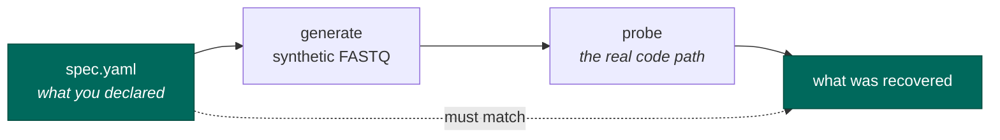

# Adding a technology

The knowledge base has one directory per sequencing technology. Adding one is how seqforge learns to
recognise something new.

The rule that makes this trustworthy: **every entry must be executable and self-testing.** You do not
add a technology and then write tests for it. You describe it, and the tests come from the
description.

## What an entry contains

```
kb/specs/<technology>/
    spec.yaml     what the machine needs: read layout, barcode positions, how to detect it
    README.md     what a human needs: how the assay works, what it gets confused with, gotchas
```

## The round-trip is the whole idea

`spec.yaml` describes the reads. That description is enough to *generate* reads. So:



If what comes back out does not match what you declared, your entry is wrong, and you find out
immediately — with no real data, no download, and no waiting.

```bash
pixi run -- seqforge kb roundtrip <technology>
```

This runs for **every** entry in the knowledge base automatically. Not a list someone maintains — the
test collects the entries that exist. Add a directory and it is covered, because it exists.

!!! note "This was not always true"

    The round-trip used to run over a hand-written list of three technologies while the knowledge
    base had five. One entry had no round-trip test at all, and the sentence "adding a technology
    automatically adds its own test" was simply false for as long as that list was written by hand.
    A list of what the code does is a comment with a tuple's syntax.

## Declaring what you get confused with

Some technologies are genuinely indistinguishable from the reads. Two versions of 10x share the same
geometry and the same barcode list. That is a fact about biology and chemistry, not a gap in our
code, and the honest thing is to write it down:

```yaml
confusable_with:
  - id: some-other-tech
    relationship: processing_equivalent   # or: processing_divergent
    distinguishable_by: [onlist]          # what CAN tell them apart
    note: >
      Why they collide, in a sentence someone can check.
```

The relationship decides what the resolver does:

- **`processing_equivalent`** — they produce identical settings, so the distinction cannot change
  anything. Record both names, ask nothing.
- **`processing_divergent`** — they would produce *different* pipelines. This must be resolved, by
  whatever `distinguishable_by` names.

**You cannot get away with not declaring it.** A check generates each entry's reads and asks every
other entry whether it would claim them using only the cheap probes. If it would, and you did not
declare it, that is an error.

That check found a real one on its first run: the generic paired-end entry — which requires little
and forbids less — happily accepts SPLiT-seq's files on geometry alone. The system already knew, in
the sense that a test comment said so. But a comment is not something the resolver can read.

## Before you open the pull request

```bash
pixi run -- seqforge kb lint <technology>     # schema + the parse/count line
pixi run -- seqforge kb roundtrip <technology> # declared == recovered
pixi run -- seqforge kb show <technology>      # eyeball it
pixi run test                                  # the pairwise checks live here
```

## Two things that will trip you up

**Only say how to parse, never what to count.** `backend.params` is for settings the *bytes* decide —
where the barcode starts, how long it is, which strand. It is not for what to count. That distinction
is enforced by an allowlist, and it exists because getting it wrong cost a measured 40.7% of a nuclear
library: counting rules were filed as a property of the chemistry, when the chemistry is identical
for cells and nuclei and what actually differs is how the sample was prepared.

**Never type a barcode position from memory.** Positions are computed from the element coordinates
you declare, because a published position is specific to a chemistry version in a way that invites
disaster. SPLiT-seq's first-round barcode sits at 86–93 in the original, and at 78–85 in the
commercial descendant. A remembered number is a coin flip between two real chemistries. Declare where
the elements are; let the code derive the rest.
