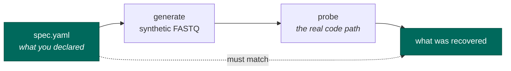

# Adding a technology

The knowledge base has one directory per sequencing technology. Adding one is how seqforge learns to
recognise something new. The rule that makes it trustworthy: **every entry is executable and
self-testing.** You describe the technology, and the tests come from the description.

```text
kb/specs/<technology>/
    spec.yaml     what the machine needs: read layout, barcode positions, how to detect it
    README.md     what a human needs: how the assay works, what it gets confused with, gotchas
```

## The round-trip is the whole idea

`spec.yaml` describes the reads well enough to *generate* reads. So generate them, probe them, and
check you get back what you declared:



```bash
pixi run -- seqforge kb roundtrip <technology>
```

If what comes out does not match what you declared, your entry is wrong — no real data, no download,
no waiting. This runs for **every** entry automatically: the test collects the entries that exist, so
adding a directory covers it.

## Declaring what you get confused with

Some technologies are genuinely indistinguishable from the reads — two versions of 10x share the same
geometry and the same barcode list. That is a fact about the chemistry, not a gap in our code, so
write it down:

```yaml
confusable_with:
  - id: some-other-tech
    relationship: processing_equivalent   # or: processing_divergent
    distinguishable_by: [onlist]          # what CAN tell them apart
    note: >
      Why they collide, in a sentence someone can check.
```

- **`processing_equivalent`** — identical settings, so the distinction cannot change anything. Record
  both names, ask nothing.
- **`processing_divergent`** — different pipelines. Must be resolved, by whatever
  `distinguishable_by` names.

**You cannot get away with not declaring it.** A check generates each entry's reads and asks every
other entry whether it would claim them using only the cheap probes. If it would, and you did not
declare it, that is an error.

## Two things that will trip you up

**Only say how to parse, never what to count.** `backend.params` is for what the *bytes* decide —
where the barcode starts, how long it is, which strand. Not for what to count. An allowlist enforces
it, because getting it wrong cost a measured 40.7% of a nuclear library: counting rules were filed as
a property of the chemistry, when the chemistry is identical for cells and nuclei.

**Never type a barcode position from memory.** Positions are computed from the element coordinates
you declare. SPLiT-seq's first-round barcode sits at 86–93 in the original and 78–85 in the
commercial descendant — a remembered number is a coin flip between two real chemistries.

## Before you open the pull request

```bash
pixi run -- seqforge kb lint <technology>      # schema + the parse/count line
pixi run -- seqforge kb roundtrip <technology> # declared == recovered
pixi run -- seqforge kb show <technology>      # eyeball it
pixi run -- pre-commit install                 # once per clone: format, lint, typecheck
pixi run check                                 # the full suite, where the pairwise checks live
```
